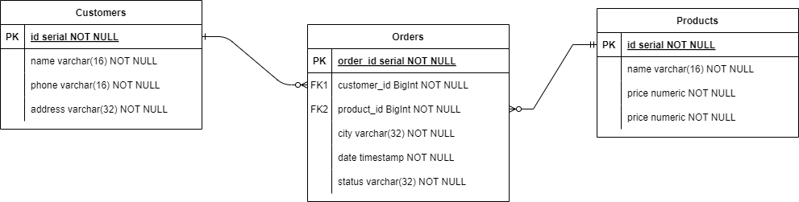

# Spring Boot 3 REST API Uygulaması

## 📌 Proje Tanıtımı

Spring Boot 3 REST API Uygulaması, JPA (Hibernate) Code First yaklaşımını kullanarak PostgreSQL veritabanında **customers**, **orders** ve **products** tablolarının oluşturulmasını ve bu tablolar üzerinde CRUD operasyonlarının gerçekleştirilmesini amaçlayan modern bir projedir.

## 🏗️ Kullanılan Teknolojiler

- **Backend**: Spring Boot 3, Hibernate  
- **Veritabanı**: PostgreSQL  
- **Veritabanı Bağlantısı**: PostgreSQL Driver  
- **Kod Düzenleme**: Lombok  
- **API Dokümantasyonu**: Swagger-UI
- **Logging**

## ⚙️ Özellikler

### 🔹 CRUD Operasyonları
- REST Controller'lar içerisinde yer alan endpoint'ler ile müşteriler, siparişler ve ürünler üzerinde CRUD işlemleri gerçekleştirilir.

### 🔹 DTO Yapısı
- **AddDTO**: Yeni kayıt ekleme işlemleri için kullanılır.
- **GetDTO**: Veri sorgulama ve listeleme işlemleri için kullanılır.
- **UpdateDTO**: Varolan kayıtların güncellenmesi işlemleri için kullanılır.

### 🔹 Exception Yönetimi
- **Custom Exception'lar**:
  - `DuplicatePhoneNumberException`
  - `ResourceAlreadyExistsException`
  - `ResourceNotFoundException`
- **Global Exception Handler**: Uygulamaya özel hata yönetimi ile, 404 gibi durumlarda varsayılan hata mesajları yerine özelleştirilmiş mesajlar döndürülür.

## 📂 Veritabanı Şeması

Uygulama, aşağıda belirtilen veritabanı mimarisiyle çalışmaktadır.  

